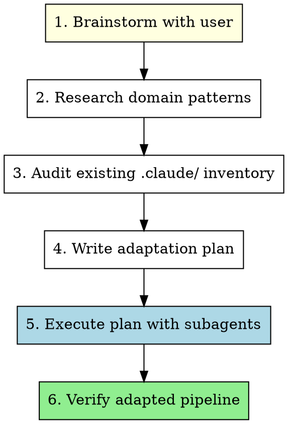

# Adapting Claude Pipeline to a Codebase

## Overview

Adapt the generic `.claude/` pipeline folder to a specific project's tech stack, domain, and workflows. This means modifying, replacing, or removing every skill, agent, hook, script, prompt, and setting so they serve the target codebase — not the template defaults.

**Core principle:** Every file in `.claude/` must earn its place. If it doesn't serve the target project, delete it. If it needs modification, modify it. If new capabilities are needed, create them.

**Sync safety:** Stack-specific files you customize are stored in `.claude/local/` (gitignored). After pulling upstream pipeline changes, run `.claude/scripts/apply-local.sh` to re-apply your customizations on top of updated generic defaults.

## When to Use

- Cloning the claude-pipeline repo into a new project
- Onboarding an existing codebase with the generic `.claude/` folder
- Switching tech stacks (e.g., Laravel to Python, web to CLI, monolith to microservices)

## The Process



---

### Phase 0: Initialize Local Overrides

Create the local customization directory and copy stack-specific files you'll modify:

```bash
mkdir -p .claude/local/agents .claude/local/config .claude/local/skills .claude/local/prompts/frontend

# Copy stack-specific agents you want to customize
cp .claude/agents/fastify-backend-developer.md .claude/local/agents/
cp .claude/agents/react-frontend-developer.md .claude/local/agents/
cp .claude/agents/playwright-test-developer.md .claude/local/agents/

# Copy config for customization
cp .claude/config/platform.sh .claude/local/config/

# Copy any stack-specific skills you want to keep and customize
# (Delete from local/ any you don't need — they'll stay as generic defaults)
```

All modifications in subsequent phases should target files in `.claude/local/`, not the originals. After customization, run:

```bash
.claude/scripts/apply-local.sh
```

This copies your customizations over the generic defaults. The `.claude/local/` directory is gitignored in the pipeline repo, so upstream pulls never overwrite your work.

**Already adapted?** After pulling upstream changes, just run `apply-local.sh` to re-apply.

### Phase 1: Brainstorm

**REQUIRED:** Use the `brainstorming` skill to explore the target project.

Focus questions on:
- **Tech stack:** Language, framework, database, infrastructure
- **Project type:** Web app, CLI tool, library, API, microservice, data pipeline, etc.
- **Team workflows:** CI/CD, code review, deployment, testing patterns
- **Pain points:** What does the team struggle with that agents could help?
- **Existing tooling:** Linters, formatters, test runners, build systems
- **Scope:** Full adaptation or partial (e.g., keep orchestration, replace agents)?
- **Platform & workflow:**
  - **Issue tracker:** GitHub Issues or Jira? If Jira: project key, preferred CLI (acli recommended), workflow transitions (what are the states, what's the "done" transition name?)
  - **Git host:** GitHub or GitLab? Merge strategy preference (squash/merge/rebase)?
  - **CI/CD:** What runs in CI? How are tests triggered?
- **Testing:**
  - **Unit tests:** What test runner? What command?
  - **E2E tests:** Does the project have or need browser-based testing? If yes: Playwright already configured or needs setup? Base URL for test environment?
  - **Manual QA:** Is there a manual testing process that could be automated with Playwright?
- **MCP tools:**
  - **Context7:** Available? What frameworks/libraries should agents look up via Context7?
  - **Serena:** Available? Useful for codebase navigation in this project?
  - **Other MCP servers:** Any project-specific MCP integrations?

Key decisions to reach:
1. Which existing skills/agents/hooks are **relevant** (keep/modify)?
2. Which are **irrelevant** (delete)?
3. What **new** capabilities does the project need?
4. What domain-specific best practices should agents follow?

### Phase 2: Research Domain Patterns

**Use WebSearch to investigate the target project's domain.** This feeds directly into agent definitions and skill content.

Search for:
```
"[language/framework] best practices [current year]"
"[language/framework] anti-patterns"
"[language/framework] code review checklist"
"[language/framework] common mistakes"
"[language/framework] testing best practices"
"[language/framework] security considerations"
"[language/framework] project structure conventions"
"[tool/framework] CI/CD pipeline best practices"
```

**Capture findings as notes** — they will be incorporated into:
- Agent anti-patterns sections
- Skill content (technique skills)
- Hook logic (formatting, linting)
- Orchestration script stages

### Phase 3: Audit Existing Inventory

Categorize every `.claude/` file into one of four buckets:

| Bucket | Action | Example |
|--------|--------|---------|
| **Keep as-is** | Universal process skills | brainstorming, writing-plans, TDD, systematic-debugging |
| **Modify** | Adapt to new tech stack | implement-issue (change test commands), agents (change domain) |
| **Replace** | Same purpose, different implementation | backend-developer → python-backend-developer |
| **Delete** | Irrelevant to target project | bulletproof-frontend (for a CLI tool), frontend-developer (for a CLI tool) |

#### Inventory Checklist

**Skills (20 in template):**

| Skill | Category | Typical Decision |
|-------|----------|-----------------|
| brainstorming | Process | Keep as-is |
| bulletproof-frontend | Domain (web/CSS) | Keep if web project with CSS focus; delete otherwise |
| dispatching-parallel-agents | Process | Keep as-is |
| executing-plans | Process | Keep as-is |
| handle-issues | Workflow | Keep as-is — platform-agnostic via wrappers |
| implement-issue | Workflow | Keep as-is — platform-agnostic via wrappers |
| investigating-codebase-for-user-stories | Process | Keep as-is |
| mcp-tools | Reference (MCP) | Keep if using Context7/Serena; delete if no MCP servers |
| playwright-testing | Domain (E2E) | Keep if project has browser UI to test; delete for CLI/API-only |
| process-pr | Workflow | Keep as-is — platform-agnostic via wrappers |
| review-ui | Domain (web/CSS) | Keep if web project; delete otherwise |
| subagent-driven-development | Process | Keep as-is |
| systematic-debugging | Process | Keep as-is |
| test-driven-development | Process | Keep as-is |
| ui-design-fundamentals | Domain (web/CSS) | Keep if web project; delete otherwise |
| using-git-worktrees | Process | Keep as-is |
| using-skills | Meta | Keep as-is |
| writing-agents | Meta | Keep as-is |
| writing-plans | Process | Keep as-is |
| writing-skills | Meta | Keep as-is |

**Agents (8 in template):**

| Agent | Category | Typical Decision |
|-------|----------|-----------------|
| backend-developer | Domain (template) | Copy to local/, customize for your backend stack |
| frontend-developer | Domain (template) | Copy to local/, customize for your frontend stack; delete from local/ if no frontend |
| e2e-test-developer | Domain (template) | Copy to local/, customize for your E2E stack; delete from local/ if no browser UI |
| bash-script-craftsman | Domain (bash) | Keep as-is if project uses bash |
| cc-orchestration-writer | Meta | Keep as-is |
| code-reviewer | Process | Copy to local/ and add tech-specific checklists |
| project-manager-backlog | Process | Keep as-is |
| spec-reviewer | Process | Keep as-is (tech-agnostic) |

**Hooks:**

| Hook | Typical Decision |
|------|-----------------|
| session-start.sh | Keep as-is (loads using-skills) |
| post-pr-simplify.sh | Modify (change PHP references) or delete |

**Settings (settings.json):**

| Setting | Typical Decision |
|---------|-----------------|
| PHP formatter (Pint) | Replace with project's formatter |
| Sensitive file protection | Modify patterns for project |
| Production deploy protection | Modify command for project |
| Desktop notifications | Keep as-is |

**Scripts:**

| Script | Typical Decision |
|--------|-----------------|
| implement-issue-orchestrator.sh | Modify (test commands, agents) |
| batch-orchestrator.sh | Modify (agent references) |
| JSON schemas | Modify if stages change |
| BATS tests | Modify to match script changes |

**Platform wrappers (`scripts/platform/`):**

| Script | Typical Decision |
|--------|-----------------|
| All platform wrapper scripts | Keep as-is — they are platform-agnostic. Just configure `config/platform.sh` during brainstorming. |

**Platform config (`config/platform.sh`):**

| Setting | Typical Decision |
|---------|-----------------|
| TRACKER / TRACKER_CLI | Set during brainstorming: github+gh or jira+acli |
| GIT_HOST / GIT_CLI | Set during brainstorming: github+gh or gitlab+glab |
| JIRA_PROJECT / transitions | Set if using Jira |
| MERGE_STYLE | Set during brainstorming |
| TEST_UNIT_CMD / TEST_E2E_CMD | Set based on project stack |
| LINT_CMD / FORMAT_CMD | Set based on project tooling |

**Prompts:**

| Prompt | Typical Decision |
|--------|-----------------|
| frontend audit/refactor | Delete if not web, replace if different frontend |

#### Token Efficiency Audit

Context size compounds across every message in every conversation. Audit these during adaptation:

- [ ] CLAUDE.md under 200 lines (re-read on every message in every conversation — each line multiplies)
- [ ] Each agent file body under 40 lines (loaded globally; move technology checklists to `.claude/prompts/`)
- [ ] No technology-specific checklists in agent definitions (put in stage-specific prompts, loaded once per invocation)
- [ ] Rarely-used CLAUDE.md sections moved to separate files that are read on-demand

### CLAUDE.md Size Management

CLAUDE.md is loaded into every message in every conversation. Bloat here multiplies cost and latency across the entire project lifetime.

**Target size: under 2KB** (~30–40 lines maximum).

#### What belongs in CLAUDE.md

Only content that must be visible on every message:

| Content type | Examples |
|---|---|
| Run commands | `npm run dev`, `./scripts/deploy-local.sh`, test commands |
| Ports & URLs | `localhost:3000`, staging URL, prod URL |
| Credentials & env | Required env vars, secrets location, API key sources |
| Key constraints | "Never force-push main", "always squash-merge", "no debug code in prod" |
| Active issue notes | Short reminders about current bugs or in-progress work (clear when resolved) |

#### What belongs in linked files

Move verbose content out of CLAUDE.md and reference it by path:

| Content type | Where to put it |
|---|---|
| API docs, endpoint lists | `.claude/prompts/api-reference.md` |
| Skill descriptions | Individual skill SKILL.md files |
| Agent authorities & anti-patterns | Individual agent files |
| Setup cost components | `.claude/prompts/setup-costs.md` or similar |
| Water/resource requirements | `.claude/prompts/requirements.md` |
| Architecture diagrams or specs | `docs/architecture.md` |
| Long testing instructions | `.claude/prompts/testing-guide.md` |

Reference these in CLAUDE.md with a single line: `- See .claude/prompts/api-reference.md for endpoint list`

#### Lean CLAUDE.md Template

Use this as a starting point when creating a CLAUDE.md for an adapted project. Fill in the placeholders and delete sections that don't apply.

```markdown
# [Project Name]

[One-line description of what this project does.]
[One-line note on current focus or active constraint, if any.]

## Dev Commands

[start command, e.g.: npm run dev / python manage.py runserver / ./scripts/start.sh]
[test command, e.g.: npm test / pytest / ./scripts/test.sh]
[build command, e.g.: npm run build / make build]
[lint command, e.g.: npm run lint / ruff check .]
[format command, e.g.: npm run format / black .]
[deploy command, e.g.: ./scripts/deploy-local.sh]

## Ports & URLs

- Local: http://localhost:[PORT]
- Staging: [staging URL]
- Production: [prod URL]
- API: http://localhost:[API_PORT] (if separate)

## Auth & Credentials

- Env file: [.env / .env.local / config/.env]
- Required vars: [VAR_NAME_1], [VAR_NAME_2], [VAR_NAME_3]
- Secrets source: [1Password / AWS Secrets Manager / team vault / ask @teammate]

## Key Constraints

- [e.g.: Never force-push main]
- [e.g.: Always squash-merge PRs]
- [e.g.: No debug code in production]
- [e.g.: Run tests before committing]
```

**Guidelines when filling out the template:**
- Project overview: 2 lines max — what it is, current focus
- Dev commands: only the commands Claude will actually run (5–10 lines)
- Ports & URLs: only environments that exist (3–5 lines)
- Auth: env file location + required var names only — no actual secrets (3–5 lines)
- Constraints: hard rules that override Claude's defaults (3–5 lines)

Remove any section that has no content — an empty section adds noise.

#### Migration Checklist for Existing Projects

When adapting a project that already has a bloated CLAUDE.md:

- [ ] Measure current size: `wc -c CLAUDE.md` — target under 2048 bytes
- [ ] Identify sections that are never read mid-conversation (architecture docs, full requirement lists, long API references)
- [ ] Move each verbose section to an appropriately named file under `.claude/prompts/`
- [ ] Replace each moved section with a one-line reference in CLAUDE.md
- [ ] Remove resolved issue notes (e.g., "bug #79 not fixed") — these belong in GitHub Issues, not CLAUDE.md
- [ ] Remove duplicate content already covered in skill/agent files
- [ ] Verify commands, ports, credentials, and constraints remain in CLAUDE.md
- [ ] Re-measure: `wc -c CLAUDE.md` — confirm under 2KB
- [ ] Do a smoke test: open a new conversation and verify Claude still has the context it needs

### Phase 4: Write the Plan

**REQUIRED:** Use the `writing-plans` skill.

The plan should be organized into parallel workstreams where possible:

```
Workstream A: Delete irrelevant files (quick, no dependencies)
Workstream B: Modify existing files (parallel per file)
Workstream C: Create new skills (use writing-skills skill)
Workstream D: Create new agents (use writing-agents skill)
Workstream E: Modify orchestration scripts (use cc-orchestration-writer agent)
Workstream F: Update hooks and settings
```

Each task in the plan must specify:
- **File path** to create/modify/delete
- **What changes** and why
- **Which skill/agent** to use for the task (writing-skills, writing-agents, cc-orchestration-writer, etc.)
- **Dependencies** on other tasks (if any)

### Phase 5: Execute with Subagents

**REQUIRED:** Use the `subagent-driven-development` skill to execute the plan.

Route tasks to the correct agent/skill:

| Task Type | How to Execute |
|-----------|---------------|
| **Delete files** | Direct (no subagent needed) |
| **Modify existing skills** | Edit directly, following writing-skills patterns |
| **Create new skills** | Invoke `writing-skills` skill |
| **Modify existing agents** | Edit directly, following writing-agents patterns |
| **Create new agents** | Invoke `writing-agents` skill |
| **Modify orchestration scripts** | Dispatch `cc-orchestration-writer` agent via Task tool |
| **Modify hooks/settings** | Direct edit |
| **Create new hooks** | `bash-script-craftsman` agent via Task tool |
| **Apply customizations** | Run `.claude/scripts/apply-local.sh` after all modifications |

**Note:** All modifications to stack-specific files should target `.claude/local/`, not the originals. The apply script copies them into place.

**Platform configuration task:**
Based on brainstorming answers, modify `.claude/config/platform.sh`:
- Set TRACKER, TRACKER_CLI, GIT_HOST, GIT_CLI
- Set JIRA_PROJECT, JIRA_DONE_TRANSITION, JIRA_IN_PROGRESS_TRANSITION if Jira
- Set MERGE_STYLE
- Set TEST_UNIT_CMD, TEST_E2E_CMD, LINT_CMD, FORMAT_CMD based on project stack

**Parallel execution:** Tasks in different workstreams with no shared files can run in parallel using `dispatching-parallel-agents`.

### Phase 6: Verify

After all modifications:

1. **File inventory check** — Glob `.claude/` and verify no orphaned or irrelevant files remain
2. **Cross-reference check** — Grep for references to deleted skills/agents/files and fix broken refs
3. **Settings validation** — Ensure settings.json hooks reference existing files and commands
4. **Skill description audit** — All skill descriptions match new project context
5. **Agent coordination audit** — Deferral relationships between agents are consistent
6. **Dry run** — Walk through a typical workflow (e.g., implement-issue) mentally to verify the pipeline makes sense
7. **Local override check** — Verify all customized files exist in `.claude/local/` and `apply-local.sh` runs cleanly

## Common Adaptation Patterns

### Web to CLI/Library

**Delete:** bulletproof-frontend, review-ui, ui-design-fundamentals, frontend-developer agent, all frontend prompts

**Replace:** backend-developer → language-specific developer agent

**Modify:** code-reviewer (add language-specific checklists), test validators (change framework)

### Laravel to Python/Django

**Replace:** backend-developer → django-backend-developer, e2e-test-developer → pytest-validator

**Modify:** settings.json (formatter → Black/Ruff), code-reviewer (add Python-specific checklists)

### Monolith to Microservices

**Add:** Service-specific agents, API contract validation skill, cross-service testing patterns

**Modify:** implement-issue workflow (multi-repo awareness), code-reviewer (service boundaries)

### Adding New Domain

**Add:** Domain-specific agents (ML engineer, data pipeline developer, etc.), domain testing skills

**Keep:** All process skills, orchestration infrastructure

## Red Flags

- **Keeping irrelevant skills** "just in case" — delete them. They add noise and confuse skill discovery.
- **Generic agent personas** — every agent should reference the actual project, its structure, and its conventions.
- **Orphaned references** — grep for deleted skill/agent names in remaining files.
- **Skipping web research** — domain patterns and anti-patterns are critical for agent quality.
- **Not updating settings.json** — stale hooks that reference missing tools will cause errors.

## Key Principles

- **Delete aggressively** — fewer, focused files beat a bloated pipeline
- **Research before writing** — WebSearch for domain patterns before creating agents/skills
- **Test the pipeline** — walk through a real workflow after adaptation
- **Use the meta-skills** — writing-skills and writing-agents exist to ensure quality; use them for new content
- **Preserve process skills** — brainstorming, TDD, debugging, planning are universal; don't delete these
