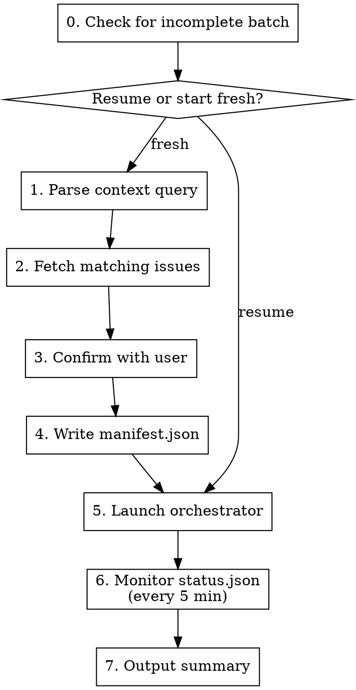

# Handle Issues

Batch process multiple GitHub issues by launching `batch-orchestrator.sh` which handles the execution loop, rate limits, and status tracking autonomously. This skill focuses on setup and monitoring.

**Announce at start:** "Using handle-issues to batch process issues. Query: $CONTEXT"

**Arguments:**
- `$1` — Context query describing which issues to process and how (required)

**Examples:**
- `/handle-issues "issues assigned to @me ordered by priority"`
- `/handle-issues "all open bugs labeled 'critical'"`
- `/handle-issues "issues in milestone v2.0 by creation date"`
- `/handle-issues "Tailwind removal issues 306-308"` (frontend work)

## Agent Selection

The orchestrator uses specialized agents via `--agent` flag to ensure the right expertise for each stage:

| Stage | Agent | Purpose |
|-------|-------|---------|
| implement-issue | project-specific agent | Use the agent matching the issue's domain (configured during /adapting-claude-pipeline) |
| implement-issue | (default) | General implementation |
| process-pr | `code-reviewer` | **Always** - reviews PR/MR for quality and standards |

**Determine agent based on issue content:**
- Check which agents are configured in `.claude/agents/` for this project
- Match the issue's domain to the appropriate agent
- **Mixed or unclear**: Use default (no agent specified)

**Ask user during confirmation** which agent to use if issue type is ambiguous.

## Architecture

```
┌─────────────────────────────────────────────────────────────────┐
│ handle-issues (this skill)                                      │
│  • Gathers issues via platform wrappers                          │
│  • Determines appropriate agent for issue type                  │
│  • Confirms with user (ONLY interaction point)                  │
│  • Writes manifest.json (includes agent)                        │
│  • Launches batch-orchestrator.sh (background)                  │
│  • Reads status.json every 5 minutes                            │
│  • Outputs summary when complete                                │
└─────────────────────────────────────────────────────────────────┘
                              │
                              ▼
┌─────────────────────────────────────────────────────────────────┐
│ batch-orchestrator.sh (shell script)                            │
│  • Loops through issues SEQUENTIALLY                            │
│  • Each issue: feature branch → implement → merge → next        │
│  • Parses structured_output via jq                              │
│  • Updates status.json after each operation                     │
│  • Handles rate limits, timeouts, circuit breaker               │
└─────────────────────────────────────────────────────────────────┘

Claude CLI invocations:
  claude -p "/implement-issue #N branch" \
    --agent <frontend|backend> \
    --dangerously-skip-permissions \
    --output-format json \
    --json-schema implement-issue.json

  claude -p "/process-pr #PR #issue branch" \
    --agent code-reviewer \
    --dangerously-skip-permissions \
    --output-format json \
    --json-schema process-pr.json
```

## Process



### Step 0: Check for Incomplete Batch

Before fetching issues, check if a previous batch was interrupted:

```bash
if [[ -f status.json ]]; then
    STATE=$(jq -r '.state' status.json)

    if [[ "$STATE" == "running" || "$STATE" == "circuit_breaker" ]]; then
        PROGRESS=$(jq -r '.progress | "\(.completed)/\(.total) complete, \(.failed) failed, \(.pending) pending"' status.json)
        LOG_DIR=$(jq -r '.log_dir' status.json)
        BRANCH=$(jq -r '.base_branch' status.json)

        echo "## Incomplete Batch Detected"
        echo ""
        echo "**State:** $STATE"
        echo "**Progress:** $PROGRESS"
        echo "**Branch:** $BRANCH"
        echo "**Log dir:** $LOG_DIR"
        echo ""

        # Show pending issues
        echo "**Pending issues:**"
        jq -r '.issues[] | select(.status == "pending" or .status == "in_progress") | "- #\(.number)"' status.json
        echo ""
    fi
fi
```

**Use AskUserQuestion with options:**
1. Resume (continue with pending issues)
2. Start fresh (abandon previous batch)

If resuming, skip to Step 5 (launch orchestrator). The orchestrator's idempotency check will skip completed issues.

### Step 1: Parse Context Query

Extract from the user's context query:
- **Filter criteria**: assignee, labels, milestone, author, state
- **Sort order**: priority, created, updated, comments
- **Limit**: max issues to process (default: no limit)

### Step 2: Fetch Matching Issues

Build and execute `gh` command based on parsed criteria:

```bash
PLATFORM_DIR=".claude/scripts/platform"

# Example: issues assigned to user
"$PLATFORM_DIR/list-issues.sh" --assignee "@me" --state open

# Example: critical bugs
"$PLATFORM_DIR/list-issues.sh" --labels "bug,critical" --state open

# Example: Jira issues (when TRACKER=jira)
"$PLATFORM_DIR/list-issues.sh" --jql "project = KIN AND assignee = currentUser() ORDER BY priority DESC"
```

**Sort by priority** (if requested): Order by label priority:
1. `priority:critical` or `P0`
2. `priority:high` or `P1`
3. `priority:medium` or `P2`
4. `priority:low` or `P3`
5. No priority label

### Step 3: Display Issue List for Confirmation

Present the ordered list before processing:

```
Found N issues matching "$CONTEXT":

1. #123 - Fix login redirect loop [priority:high, bug]
2. #456 - Add password reset flow [priority:medium, feature]
3. #789 - Update user profile validation [priority:low, enhancement]

Base branch: aw-next

Proceed with batch processing? (yes/no)
```

**This is the ONLY user interaction point.** After confirmation, the entire batch runs autonomously.

**Use AskUserQuestion** to confirm:
- Option 1: "Yes, proceed"
- Option 2: "No, cancel"
- Allow user to specify different base branch if needed

### Step 4: Write Manifest

Create the manifest file for the orchestrator:

```bash
MANIFEST="logs/handle-issues/manifest-$(date +%Y%m%d-%H%M%S).json"
mkdir -p logs/handle-issues

# Build issues array from fetched list
# $AGENT is determined from issue type (frontend/backend/default)

# $ISSUE_IDS is a comma-separated list like "123,456,789" or "KIN-1,KIN-2,KIN-3"
jq -n \
  --arg issues "$ISSUE_IDS" \
  --arg branch "$BASE_BRANCH" \
  --arg query "$CONTEXT" \
  --arg agent "$AGENT" \
  '{
    issues: ($issues | split(",") | map(gsub("^\\s+|\\s+$"; ""))),
    base_branch: $branch,
    agent: (if $agent == "" then null else $agent end),
    query: $query,
    created_at: (now | todate)
  }' > "$MANIFEST"

echo "Manifest written to: $MANIFEST"
```

**Agent values:**
- Use project-specific agents configured in `.claude/agents/` during `/adapting-claude-pipeline`
- `null` or omitted — Default behavior

### Step 5: Launch Orchestrator

Launch the batch orchestrator as a background process:

```bash
# Launch orchestrator (agent is read from manifest, or can be overridden via --agent)
nohup .claude/scripts/batch-orchestrator.sh --manifest "$MANIFEST" \
  > "logs/handle-issues/orchestrator-$(date +%Y%m%d-%H%M%S).log" 2>&1 &

# Or with explicit agent override:
# nohup .claude/scripts/batch-orchestrator.sh --manifest "$MANIFEST" --agent bulletproof-frontend-developer \
#   > "logs/handle-issues/orchestrator-$(date +%Y%m%d-%H%M%S).log" 2>&1 &

ORCHESTRATOR_PID=$!
echo "$ORCHESTRATOR_PID" > logs/handle-issues/.orchestrator.pid

echo "Orchestrator launched (PID: $ORCHESTRATOR_PID)"
echo "Status file: status.json"
echo "Logs: logs/batch-*/"
```

The orchestrator will:
- Use the specified agent for `implement-issue` stage
- Always use `code-reviewer` agent for `process-pr` stage

### Step 6: Monitor Progress

Check status.json every minute until complete, then display the completion summary. Both the monitoring loop and summary are in a single bash block so they execute atomically:

```bash
echo ""
echo "Monitoring progress (checking every minute)..."
echo ""

BASE_BRANCH=$(jq -r '.base_branch' status.json)
DEADLINE=$((SECONDS + 10800))  # 3-hour wall-clock guard

# Expected timeouts per stage (seconds) — used for stuck detection
_stage_timeout() {
    case "$1" in
        implement-issue) echo 3600 ;;  # 60 min
        process-pr)      echo 1800 ;;  # 30 min
        *)               echo 3600 ;;  # default 60 min
    esac
}

while true; do
    # Wall-clock deadline guard
    if (( SECONDS > DEADLINE )); then
        echo "⚠️ Monitor timeout — check status.json manually"
        break
    fi

    # Check if orchestrator is still running
    if [[ -f logs/handle-issues/.orchestrator.pid ]]; then
        ORCHESTRATOR_PID=$(cat logs/handle-issues/.orchestrator.pid)
        if ! kill -0 "$ORCHESTRATOR_PID" 2>/dev/null; then
            echo "Orchestrator process finished."
            rm -f logs/handle-issues/.orchestrator.pid
            break
        fi
    else
        break
    fi

    # Read and display progress
    if [[ -f status.json ]]; then
        STATE=$(jq -r '.state' status.json)
        COMPLETED=$(jq -r '.progress.completed' status.json)
        FAILED=$(jq -r '.progress.failed' status.json)
        TOTAL=$(jq -r '.progress.total' status.json)
        CURRENT=$(jq -r '.current_issue // "none"' status.json)
        CURRENT_STAGE=$(jq -r '.current_stage // ""' status.json)
        STAGE_STARTED_AT=$(jq -r '.stage_started_at // ""' status.json)
        RATE_LIMITED=$(jq -r '.rate_limit.waiting' status.json)

        # Compute stage elapsed time
        ELAPSED_STR=""
        STUCK_WARNING=""
        if [[ -n "$STAGE_STARTED_AT" && "$STAGE_STARTED_AT" != "null" ]]; then
            NOW=$(date +%s)
            # Parse ISO 8601 — try GNU date first, fall back to BSD date (macOS)
            STAGE_START=$(date -d "$STAGE_STARTED_AT" +%s 2>/dev/null \
                || date -j -f "%Y-%m-%dT%H:%M:%SZ" "$STAGE_STARTED_AT" +%s 2>/dev/null \
                || echo "")
            if [[ -n "$STAGE_START" && "$STAGE_START" =~ ^[0-9]+$ ]]; then
                ELAPSED=$(( NOW - STAGE_START ))
                ELAPSED_MIN=$(( ELAPSED / 60 ))
                ELAPSED_SEC=$(( ELAPSED % 60 ))
                ELAPSED_STR=" (${ELAPSED_MIN}m ${ELAPSED_SEC}s running)"

                STAGE_TIMEOUT=$(_stage_timeout "$CURRENT_STAGE")
                THRESHOLD=$(( STAGE_TIMEOUT * 80 / 100 ))
                if (( ELAPSED > THRESHOLD )); then
                    STUCK_WARNING="⚠️ Stage running longer than expected — may need attention"
                fi
            fi
        fi

        # Calculate lines changed since start (vs base branch)
        LINES_CHANGED=$(git diff "$BASE_BRANCH"...HEAD --shortstat 2>/dev/null | grep -oE '[0-9]+ insertion|[0-9]+ deletion' | grep -oE '[0-9]+' | paste -sd+ | bc 2>/dev/null || echo "0")

        if [[ "$RATE_LIMITED" == "true" ]]; then
            RESUME_AT=$(jq -r '.rate_limit.resume_at' status.json)
            echo "[$(date +%H:%M)] $COMPLETED/$TOTAL | #$CURRENT $CURRENT_STAGE$ELAPSED_STR | Lines changed: $LINES_CHANGED | Rate limited until $RESUME_AT"
        else
            echo "[$(date +%H:%M)] $COMPLETED/$TOTAL | #$CURRENT $CURRENT_STAGE$ELAPSED_STR | Lines changed: $LINES_CHANGED"
        fi

        if [[ -n "$STUCK_WARNING" ]]; then
            echo "$STUCK_WARNING"
        fi

        # Exit conditions
        if [[ "$STATE" == "completed" || "$STATE" == "completed_with_errors" || "$STATE" == "circuit_breaker" ]]; then
            break
        fi
    fi

    sleep 300  # 5 minutes
done

# Output completion summary (same bash block — always executes after loop)
STATE=$(jq -r '.state' status.json)
COMPLETED=$(jq -r '.progress.completed' status.json)
FAILED=$(jq -r '.progress.failed' status.json)
TOTAL=$(jq -r '.progress.total' status.json)
LOG_DIR=$(jq -r '.log_dir' status.json)

echo ""
echo "## Handle Issues Complete"
echo ""
echo "**State:** $STATE"
echo "**Progress:** $COMPLETED/$TOTAL completed, $FAILED failed"
echo ""
echo "### Results"
echo ""
echo "| Issue | PR | Status | Follow-ups |"
echo "|-------|-----|--------|------------|"

jq -r '.issues[] | "| #\(.number) | \(if .pr then "#\(.pr)" else "—" end) | \(.status) | \(.follow_ups // [] | if length > 0 then map("#\(.)") | join(", ") else "—" end) |"' status.json

# Show failures if any
if [[ $FAILED -gt 0 ]]; then
    echo ""
    echo "### Failed Issues"
    echo ""
    jq -r '.issues[] | select(.status == "failed" or .status == "skipped") | "- **#\(.number)**: \(.error // "Unknown error")"' status.json
fi

# Show circuit breaker message if triggered
if [[ "$STATE" == "circuit_breaker" ]]; then
    echo ""
    echo "### Circuit Breaker Triggered"
    echo ""
    echo "3 consecutive failures detected. Batch stopped to prevent further issues."
    echo ""
    echo "**To resume:** Fix the underlying issues, then run:"
    echo "\`/handle-issues \"resume\"\`"
fi

echo ""
echo "**Logs:** $LOG_DIR"
```

## Files

| File | Purpose |
|------|---------|
| `.claude/scripts/batch-orchestrator.sh` | Main orchestration script (loops through issues) |
| `.claude/scripts/schemas/implement-issue.json` | JSON schema for implement-issue output |
| `.claude/scripts/schemas/process-pr.json` | JSON schema for process-pr output |
| `status.json` | Real-time status (read by this skill, written by orchestrator) |
| `logs/handle-issues/manifest-*.json` | Batch manifest (issues list + branch) |
| `logs/batch-*/` | Per-batch logs and summary |
| `logs/.batch-orchestrator.lock` | Lock file preventing parallel batches |

## Integration

**Requires:**
- `.claude/scripts/batch-orchestrator.sh` (orchestration script)
- `.claude/scripts/schemas/*.json` (JSON schemas)
- `implement-issue` skill (invoked by orchestrator)
- `process-pr` skill (invoked by orchestrator)
- Platform CLI authenticated (gh, glab, or acli — configured in .claude/config/platform.sh)
- `jq` for JSON parsing
- Claude Code CLI installed

**Creates:**
- One PR per issue (via implement-issue)
- Merged PRs with closed issues (via process-pr)
- Follow-up issues from review comments (via process-pr)
- status.json with real-time progress
- Log directory with per-issue logs

## Red Flags

| Temptation | Why It Fails |
|------------|--------------|
| Manage the loop yourself | Context bloat. Let orchestrator handle it. |
| Check status more often than 5 min | Unnecessary overhead. Orchestrator updates status.json. |
| Skip the confirmation step | May process wrong issues. |
| Run multiple batches in parallel | Issues are processed sequentially to avoid merge conflicts. Lock file exists for a reason. |
| Ignore incomplete batch check | May reprocess or lose progress. |

## Example Session (Backend)

```
User: /handle-issues "open issues assigned to me, priority order"

Claude: Using handle-issues to batch process issues. Query: open issues assigned to me, priority order

Found 3 issues:
1. #130 - Critical auth bug [priority:critical]
2. #128 - Add MFA support [priority:high]
3. #125 - Update docs [priority:low]

Base branch: aw-next
Agent: (determined from issue content and configured agents)
Proceed with batch processing? (yes/no)

User: yes

Claude: Launching batch orchestrator...
Orchestrator launched (PID: 12345)
Implement agent: (project-specific)
Process-PR agent: code-reviewer
...
```

## Example Session (Frontend)

```
User: /handle-issues "Tailwind removal issues 306-308"

Claude: Using handle-issues to batch process issues. Query: Tailwind removal issues 306-308

Found 3 issues:
1. #306 - Tailwind Removal: Admin Pages
2. #307 - Tailwind Removal: Dashboard & Notifications
3. #308 - Tailwind Removal: Auth, Account, Landing Components

Base branch: aw-next
Agent: (determined from issue content and configured agents)
Proceed with batch processing? (yes/no)

User: yes

Claude: Launching batch orchestrator...
Orchestrator launched (PID: 12345)
Implement agent: (project-specific)
Process-PR agent: code-reviewer

Monitoring progress (checking every 5 minutes)...

[14:30] 0/3 complete, 0 failed | Current: #306 | Lines changed: 0
[14:35] 0/3 complete, 0 failed | Current: #306 | Lines changed: 245
[14:40] 1/3 complete, 0 failed | Current: #307 | Lines changed: 512
[15:40] 3/3 complete, 0 failed | Current: none | Lines changed: 1247
Orchestrator process finished.

## Handle Issues Complete

**State:** completed
**Progress:** 3/3 completed, 0 failed

### Results

| Issue | PR | Status | Follow-ups |
|-------|-----|--------|------------|
| #306 | #315 | completed | — |
| #307 | #316 | completed | — |
| #308 | #317 | completed | — |

**Logs:** logs/batch-20260131-143022/
```

## Resume Example

```
User: /handle-issues "open bugs"

Claude: ## Incomplete Batch Detected

**State:** circuit_breaker
**Progress:** 1/3 complete, 2 failed, 0 pending
**Branch:** aw-next
**Log dir:** logs/batch-20260129-100000/

**Pending issues:**
- #456
- #789

Options:
1. Resume (continue with pending issues)
2. Start fresh (abandon previous batch)

User: 1

Claude: Resuming batch...
Orchestrator launched (PID: 12346)
...
```
